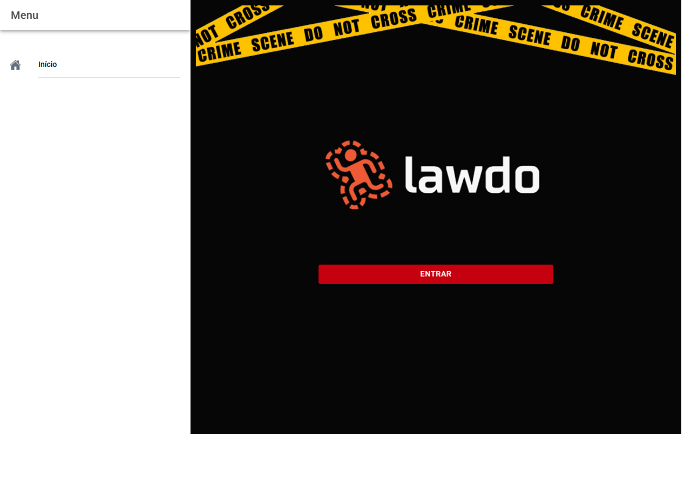

# Guia do perito — Lawdo

O **Lawdo** ajuda-o a registar um atendimento pericial no local e a gerar o **documento do laudo** em Word, com base no que for preenchendo. Este guia segue a ordem natural do trabalho: **entrar**, **preparar a conta**, **criar o atendimento**, **preencher cada parte**, **numerar o laudo** e **exportar**.

Resumos por tela (com imagens quando existirem): [Índice das telas](manual/telas/README.md).

**Screenshots:** as figuras por tela ficam em `docs/manual/images/telas/capturas/` e são geradas com Playwright — ver [`docs/manual/README.md`](manual/README.md) (`npm run screenshots` após login gravado).

---

## 1. Entrar na aplicação

Abra o Lawdo no navegador (no endereço que a sua instituição lhe indicar).

Na primeira página verá o botão **ENTRAR**. Ao tocar, abre-se a janela da **conta Google**: use a **sua conta pessoal** (a do perito), a que quiser associar o Lawdo. Os **dados dos atendimentos** e as **fotografias** recolhidos na aplicação ficam guardados **nessa mesma conta** (incluindo, quando ativo, o armazenamento no **Google Drive** e a ligação à base de dados do serviço). Se surgir pedido de autorização para o **Google Drive**, aceite se for usar pastas do Drive para imagens ou cópias do laudo — sem isso, algumas funções podem ficar limitadas.

Depois de entrar, o menu e os botões principais ficam disponíveis.

---

## 2. Primeira vez: completar a sua conta

No **primeiro acesso**, o perito deve **completar o seu perfil**. Abra **Conta** no menu (ícone da sua foto no canto também pode levar lá). Se for o primeiro uso, pode aparecer um aviso ou cartão de **boas-vindas** pedindo esse passo.

Preencha **nome completo**, **matrícula**, **sexo**, **corporação** e, se aparecer, **unidade pericial** e **superior**. Estes dados **identificam o perito** e **constam no laudo** gerado pelo Lawdo (como qualificação do signatário), por isso devem estar corretos e atualizados. Toque em **Salvar**.

Sempre que quiser terminar a sessão, use **Sair** no topo da tela da Conta.

Mais detalhes: [Conta (perfil)](manual/telas/03-conta.md).

---

## 3. Configurar onde guardar as fotografias

Em **Configurações** (menu lateral), pode indicar **em que pasta do Google Drive** (na **mesma conta Google** com que entrou) quer que as imagens do atendimento fiquem armazenadas. Toque em **Escolher pasta…** e selecione a pasta desejada; se não alterar, o sistema usa a pasta padrão indicada no texto de ajuda. O Lawdo pode organizar subpastas **por ano do protocolo**.

Guarde com **Salvar**. Se for a primeira vez a listar pastas, o Google pode pedir **nova autorização** — confirme para poder escolher a pasta.

[Mais sobre Configurações](manual/telas/04-configuracoes.md).

---

## 4. Cadastros: corporações e órgãos

**Corporações** e **Órgãos** no menu servem para **consultar** as informações institucionais já associadas ao seu utilizador (siglas, nomes, unidades). Não substituem o preenchimento do atendimento em si; são referência rápida.

[Corporações](manual/telas/05-corporacoes.md) · [Órgãos](manual/telas/06-orgaos.md)

---

## 5. Lista de atendimentos

Em **Atendimentos** (menu ou botão na página inicial), vê todos os casos que já registou. Cada linha mostra **protocolo**, **tipo de exame**, **local**, **data e hora** e se o laudo está **em aberto** ou já **concluído** (com número do laudo).

- Toque num caso para abrir o **painel desse atendimento** (resumo e acesso a todas as secções).
- O botão **+** ou **Novo atendimento** inicia um **caso novo**.

[Lista de atendimentos](manual/telas/07-atendimentos.md).

---

## 6. Novo atendimento — dados básicos do exame

Ao iniciar um novo atendimento, começa pela tela **Dados básicos**:

- **Tipo de laudo** — escolha o tipo de perícia (lista fixa no sistema).
- **Ano** e **número do protocolo** — escreva como no expediente. Se existir integração com o sistema de protocolo, pode haver um ícone para **buscar dados** após preencher ano e número.
- **Data** em que realizou o exame no local e **hora de chegada**.
- **Onde foi o exame** — cidade, bairro (quando aplicável), logradouro, ponto de referência.
- **Coordenadas** — pode preencher à mão ou usar o botão de **localização** na barra (quando o caso ainda está editável) para obter latitude e longitude pelo aparelho.

Quando estiver correto, use **Avançar** para gravar e seguir.

[Dados básicos](manual/telas/09-identificacao.md).

---

## 7. O painel do atendimento

Depois de escolher um caso na lista, entra no **painel** desse atendimento. No topo vê resumo do tipo de exame, local e data; à direita pode **editar** os dados básicos, **concluir** o atendimento quando tudo estiver fechado, ou **reabrir** se precisar corrigir um caso já concluído (quando permitido).

O corpo da tela é uma lista de **secções** — é por aqui que preenche tudo o que vai para o laudo:

Requisição · Local · Preservação · Vítimas · Veículos · Vestígios · Imagens · Dinâmica e conclusão · Laudo.

No fundo, **Exportar Laudo** gera o ficheiro Word (ver secção 19).

[Painel do atendimento](manual/telas/08-atendimento-hub.md).

---

## 8. Requisição e quesitos

Registe o **número da requisição**, **origens e destinos** (DIP), **data de recebimento**, **IP** e procure a **autoridade policial** na barra de pesquisa (o sistema sugere nomes).

Em **Quesitos**, use **Adicionar** para cada pergunta oficial e a resposta que couber no laudo. Pode editar ou apagar entradas.

[Requisição](manual/telas/10-requisicao.md).

---

## 9. Local do fato

Caracterize o local em relação ao endereço que já indicou: se é zona **urbana ou rural**, a **natureza** (via pública, imóvel, terreno, etc.), a **função** (residencial, comercial…), **tipo de construção** quando fizer sentido, **como se acede** ao local e uma **descrição** livre.

[Local do fato](manual/telas/11-local.md).

---

## 10. Preservação e isolamento

Indique **quem estava presente** no local (órgão, nome, cargo, origem, viatura) — pode acrescentar várias pessoas.

Descreva as **condições de preservação** e **isolamento** do local e as **condições gerais** que observou (texto livre).

[Preservação](manual/telas/12-preservacao.md).

---

## 11. Vítimas

Na lista de **vítimas**, use **Adicionar** para cada pessoa. Em cada ficha indique se está **identificada**, **reconhecida** ou **não reconhecida**, nome quando couber, documentos, **características físicas**, **posição do corpo**, **vestimentas**, dados da **perinecroscopia** e observações (tatuagens, pertences, etc.).

[Vítimas](manual/telas/13-vitimas.md) · [Ficha da vítima](manual/telas/14-vitima.md).

---

## 12. Mapa de ferimentos

Na ficha da vítima, os desenhos do **corpo e da cabeça** abrem o **mapa** correspondente. Escolha a ferramenta (por exemplo arma de fogo, instrumento cortante, contundente, hematoma) e marque no esquema onde observou cada lesão. Pode **desfazer** o último passo e **fechar** quando terminar. As marcações entram no material do laudo.

[Mapa de ferimentos](manual/telas/15-mapa-ferimentos.md).

---

## 13. Veículos

Liste cada veículo relevante (**Adicionar**). Em cada ficha preencha **placa**, **cor**, **ano**, **marca**, **modelo**, **tipo**, **tração**, **espécie**, e quem **apresentou** o veículo e com que **documento**.

[Veículos](manual/telas/16-veiculos.md) · [Ficha do veículo](manual/telas/17-veiculo.md).

---

## 14. Vestígios

Os vestígios aparecem agrupados por **categoria**. Para cada item pode indicar **tipo**, **descrição**, **quantidade**, **onde foi recolhido** e **lacre**. **Cadastrar vestígio** abre o formulário; pode editar ou remover depois.

[Vestígios](manual/telas/18-vestigios.md) · [Formulário de vestígio](manual/telas/19-vestigio-formulario.md).

---

## 15. Fotografias

Em **Imagens**, use **Adicionar imagens** para enviar fotos do local ou dos exames (no telemóvel pode também usar a câmara, conforme o navegador). Enquanto envia, pode ver uma barra de progresso.

**Reordenar** permite mudar a ordem em que as fotos aparecem no laudo; confirme com **Concluir**.

[Imagens](manual/telas/20-imagens.md).

---

## 16. Editar uma fotografia

Ao tocar numa miniatura, pode escrever a **legenda**, **cortar** ou **rodar** a imagem. No menu de opções pode ainda haver ferramentas de apoio à análise (por exemplo sugestões automáticas de realces), conforme o que a sua instituição ativou.

[Editor de imagem](manual/telas/21-imagem-editor.md).

---

## 17. Dinâmica e conclusão

Escolha o **tipo de dinâmica** e o **tipo de conclusão** que melhor enquadram o caso — o sistema pode sugerir texto; **revise sempre** e ajuste nos campos **Dinâmica** e **Texto**.

[Dinâmica e conclusão](manual/telas/22-dinamica-conclusao.md).

---

## 18. Numerar e datar o laudo

Na secção **Laudo**, indique o **número do laudo**, o **ano** e a **data de emissão**, de acordo com o controlo interno da sua unidade.

[Laudo](manual/telas/23-laudo.md).

---

## 19. Exportar o documento

No painel do atendimento, toque em **Exportar Laudo**.

- **Baixar o Laudo** — grava o ficheiro Word no computador ou telemóvel.
- **Salvar no Google Drive** — coloca o documento na pasta que configurou (ou na área padrão); confirme a mensagem com o caminho.

O Word reúne as secções que preencheu (texto, tabelas, imagens e mapas, conforme o caso).

### 19.1 Resultados da exportação (templates e exemplos)

O processo de exportação monta um `.docx` em três etapas:

1. **Validação mínima**: exige **número** e **ano** do laudo.
2. **Composição**: cria o documento com cabeçalho, rodapé, estilos, margens e secções.
3. **Destino**: permite **download local** ou **salvar no Google Drive**.

Templates (secções) usados na geração, em ordem:

- **Requisição**
- **Título do laudo**
- **Preâmbulo**
- **Histórico**
- **Exames** (local, isolamento, vítimas, veículos, perinecroscopia)
- **Outros elementos**
- **Conclusão**
- **Quesitos e respostas**
- **Assinatura**
- **Anexos** (registro fotográfico, croquis por vítima e geolocalização, quando houver)

Regras de inclusão condicional (resumo):

- **Conclusão** só entra se o texto de conclusão estiver preenchido.
- **Quesitos e respostas** só entra se houver quesitos cadastrados.
- **Outros elementos** entra em crime contra a vida, ou quando houver texto de dinâmica.
- **Anexos** entram quando houver imagens, croquis com marcações ou coordenadas válidas.

Exemplos de geração:

- **Numeração no documento**: laudo `123` de `2026` é formatado como `00123-2026`.
- **Nome do arquivo exportado**: laudo `2026/123` e protocolo `2026/456` gera `26-123--26-456.docx`.
- **Subtítulo do tipo de exame**: `LOCAL DE SUICÍDIO` aparece no título como `(LOCAL DE SUICÍDIO)`.
- **Texto dinâmico**: marcadores `<o>` e `<O>` em dinâmica/conclusão são substituídos pelo artigo adequado do perito.
- **Anexo geográfico**: com coordenadas válidas, é incluído apêndice de geolocalização com mapa e legenda.

---

## 20. Concluir ou reabrir um atendimento

Quando o trabalho estiver completo, no painel use **Concluir** para marcar o atendimento como encerrado. Se mais tarde precisar de correções e a sua unidade permitir **reabrir**, use **Reabrir** — os formulários voltam a ficar editáveis. Enquanto o caso estiver **concluído** ou **arquivado**, algumas telas podem impedir alterações para não alterar laudo já protocolado.

---

## 21. Menu lateral (resumo)

Abra o menu (três riscos ou ícone habitual) para ir a **Início**, **Atendimentos**, **Novo atendimento**, **Corporações**, **Órgãos**, **Conta** e **Configurações**.

[Menu do aplicativo](manual/telas/02-menu-app.md).

---

## Onde está cada coisa na tela inicial

Antes de entrar, só vê o botão **ENTRAR**. Depois de entrar, na página inicial aparecem **Atendimentos** e **Novo Atendimento**, e no topo o **menu** e o atalho para a **Conta**.

[Início](manual/telas/01-inicio.md).

---

## Informação para suporte informático

Quem mantém o sistema pode voltar a gerar imagens de exemplo ou atualizar instalações com os scripts na pasta `docs/manual`. Os peritos em geral só precisam do endereço web e de uma **conta Google** (a que utilizam para entrar e onde ficam os seus dados de trabalho).
