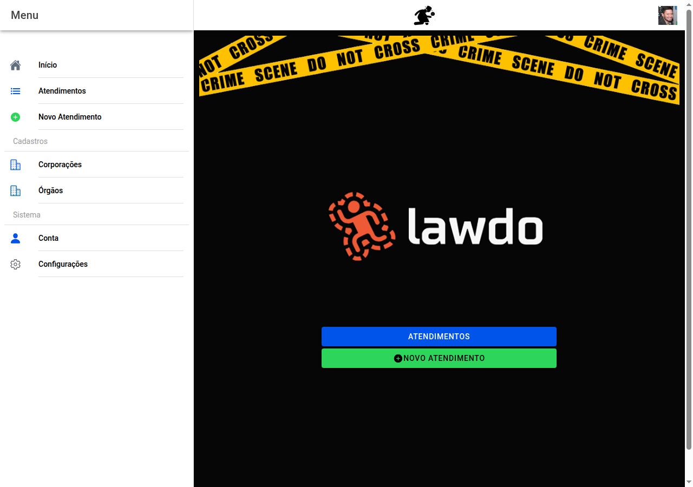

# Início

É a primeira página quando abre o Lawdo.

## Antes de entrar

Vê o nome da aplicação e um botão vermelho **ENTRAR**. É por aí que inicia sessão com uma **conta Google** — em geral a **conta pessoal do perito**, aquela em que ficam guardados os **atendimentos** e as **imagens** associados ao seu trabalho nesta aplicação. Pode aparecer um pedido do Google para permitir o uso do **Drive** — aceite se for usar fotografias ou guardar laudos no Drive dessa conta.

*(Gerada com o guia Playwright — ver [`docs/manual/README.md`](../README.md). Num telemóvel o aspeto adapta-se, mantendo os mesmos botões.)*

## Depois de entrar

Passa a ver o **menu** (ícone no canto), o **símbolo do Lawdo** no meio da barra e a sua **foto** à direita — ao tocar na foto abre a **Conta**.

No meio da página aparecem dois botões grandes:

- **Atendimentos** — lista de todos os casos seus.
- **Novo Atendimento** — começa um relatório novo, a partir dos dados básicos do local e do protocolo.

← [Índice](README.md) · [Guia completo](../MANUAL_USUARIO.md) · [Menu →](02-menu-app.md)
