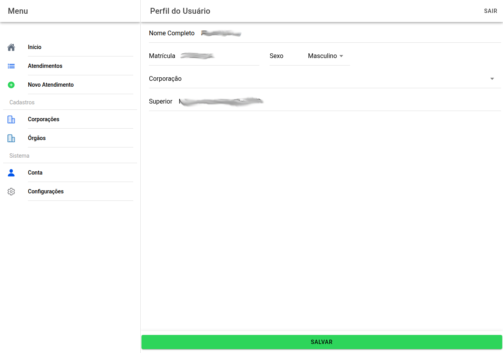

# Conta (perfil)

Aqui ficam os **dados que identificam o perito** no sistema e no laudo.

## O que preencher

- **Nome completo**
- **Matrícula**
- **Sexo**
- **Corporação** (lista) — ao escolher, pode aparecer a **unidade pericial**
- **Superior** — hierárquico, quando for obrigatório na sua organização

No primeiro acesso pode surgir uma mensagem de **boas-vindas** pedindo para completar o cadastro.

Use **Salvar** no fundo para gravar. **Sair** encerra a sessão.

← [Menu](02-menu-app.md) · [Índice](README.md) · [Configurações →](04-configuracoes.md)
