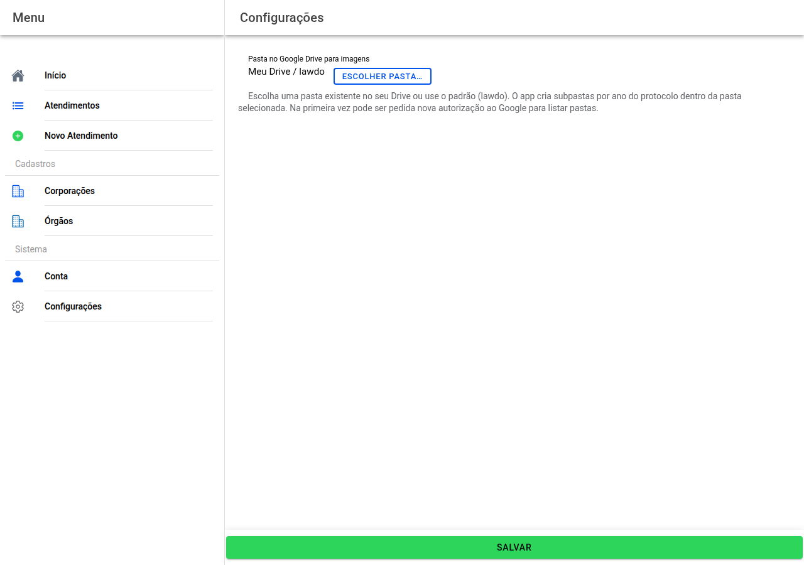

# Configurações

Serve para dizer **em que pasta do Google Drive** quer guardar as **fotografias** dos atendimentos.

Toque em **Escolher pasta…** e selecione no Drive. Se não mudar nada, o texto na página explica qual é a pasta **por padrão**. O programa pode criar **subpastas por ano** do protocolo.

A primeira vez pode ser preciso autorizar outra vez o Google a **listar pastas**.

Termine com **Salvar** no fundo.

Se o cadastro da sua conta ainda estiver incompleto, pode aparecer um aviso para ir primeiro à **Conta**.

## Captura da tela

← [Conta](03-conta.md) · [Índice](README.md) · [Corporações →](05-corporacoes.md)
