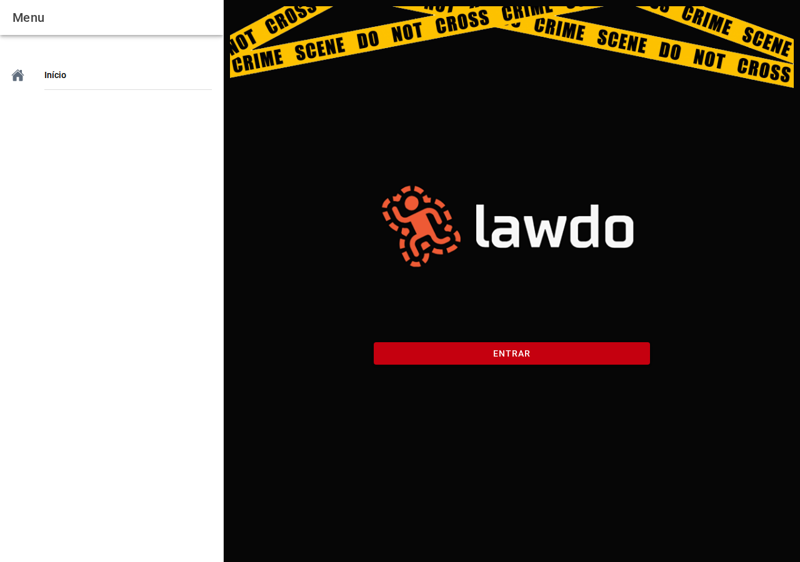

# Corporações

## Captura da tela

Lista em cartões para **consultar** corporações (símbolo, sigla e nome). Ao tocar num cartão, segue para a gestão das **unidades** dessa corporação, conforme o fluxo definido pela sua instituição.

Não é aqui que preenche o laudo — é apenas referência institucional.

← [Configurações](04-configuracoes.md) · [Índice](README.md) · [Órgãos →](06-orgaos.md)
