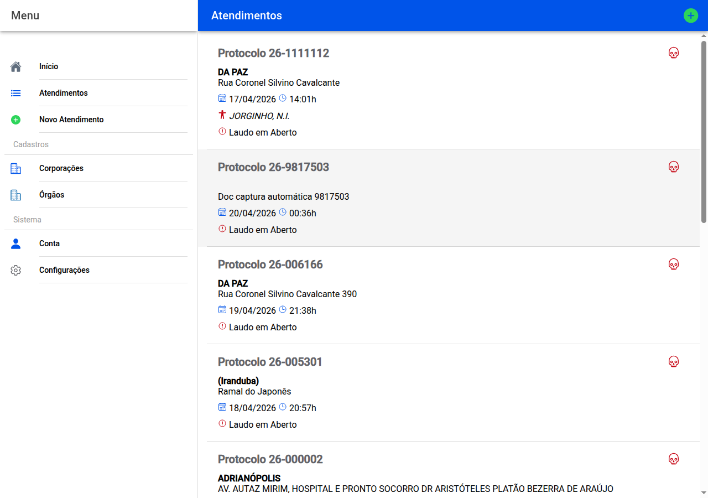

# Lista de atendimentos

## Captura da tela

É o arquivo dos **casos**: cada linha é um protocolo seu.

A lista carrega **por blocos** (scroll infinito): ao chegar ao fim do que já foi carregado, aparece “Carregando mais dados…” e acrescentam-se mais casos **mais antigos**. O tour de capturas só fotografa o primeiro bloco.

Em cada entrada vê:

- número do **protocolo** e **tipo** de exame (com um ícone que ajuda a distinguir visualmente),
- **onde** foi o exame e **quando**,
- se já tem **nome de vítimas** (nos tipos de caso em que faz sentido),
- se o laudo está **em aberto** ou já **emitido** (com número).

**Toque** numa linha para abrir o **painel** desse caso — é o centro onde entra em todas as partes do relatório.

No canto superior há um **mais (+)** para abrir um **caso novo** sem passar pela lista.

Se ainda não tiver nenhum caso, a página convida-o a criar o primeiro **Novo atendimento**.

← [Órgãos](06-orgaos.md) · [Índice](README.md) · [Painel do atendimento →](08-atendimento-hub.md)
