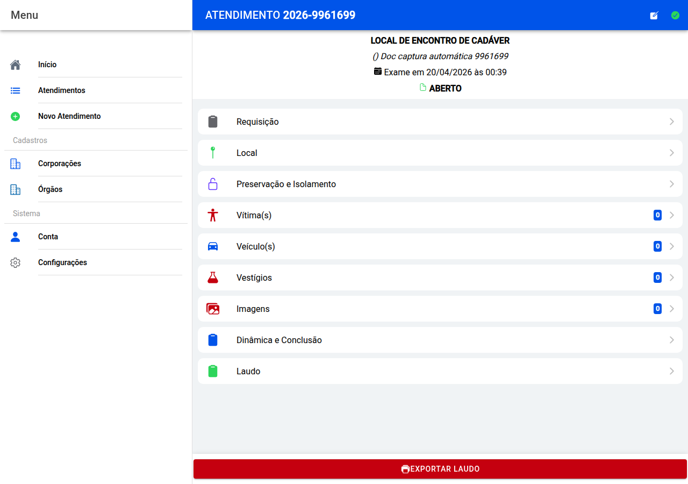

# Painel do atendimento

Depois de escolher um caso na lista, este é o **quadro de comando**: resume o protocolo e dá acesso a **todas as partes** do laudo.

## Barra superior

- **Voltar** — regressa ao atendimento anterior na navegação.
- **Editar** (lápis) — alterar os **dados básicos** (protocolo, local, data…).
- **Concluir** (visto verde) — quando o trabalho está fechado; confirme na mensagem.
- **Reabrir** — só quando o caso já estava concluído e a sua unidade permite voltar a editar.

No meio vê **tipo de exame**, **morada resumida**, **data e hora**, e uma linha sobre a **situação** do laudo.

## Secções (lista ao centro)

Toque em cada linha para preencher:

**Requisição** · **Local** · **Preservação** · **Vítimas** · **Veículos** · **Vestígios** · **Imagens** · **Dinâmica e conclusão** · **Laudo**

Os números ao lado (por exemplo vítimas ou vestígios) dizem quantos itens já registou.

## Exportar no fundo

**Exportar Laudo** — escolha **Baixar** para ter o Word no aparelho ou **Guardar no Google Drive** para o ficheiro ir para a pasta configurada.

## Captura da tela

← [Lista](07-atendimentos.md) · [Índice](README.md) · [Dados básicos →](09-identificacao.md)
