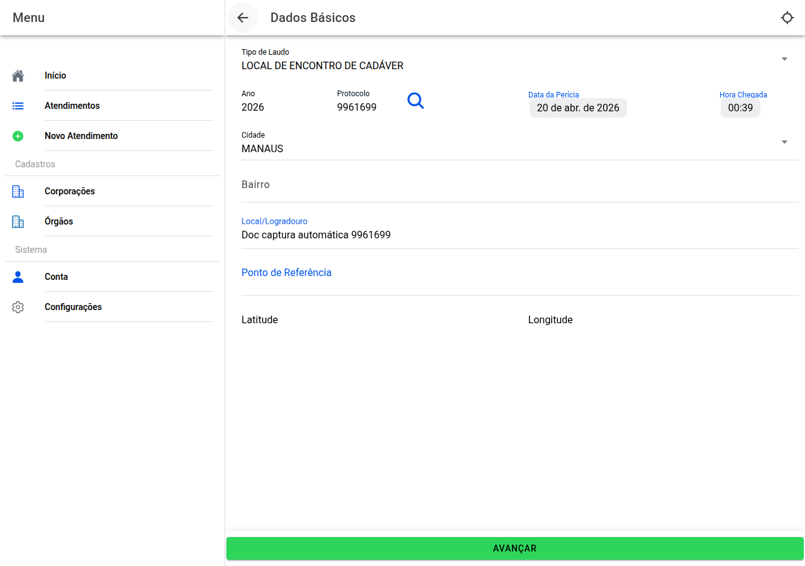

# Dados básicos do atendimento

## Captura do ecrã

Primeiro passo quando **cria** um caso novo (ou quando edita pelo ícone lápis no painel).

## O que preencher

- **Tipo de laudo** — escolha na lista (tipo de perícia/local).
- **Ano** e **número do protocolo** como no expediente oficial.
- **Data** do exame no local e **hora de chegada**.
- **Cidade**, **bairro** quando for pedido (em algumas cidades há ajuda ao escrever o bairro), **rua ou lugar**, **ponto de referência**.
- **Latitude e longitude** à mão, ou use o ícone de **localização** na barra superior para tentar ler a posição pelo aparelho *(no telefone ative a localização no sistema)*.

Se existir ligação ao sistema de protocolo, depois de preencher ano e número pode haver uma **lupa** para **trazer dados automaticamente**.

## Ao terminar

**Avançar** grava e segue para o fluxo seguinte da sua instituição.

Se sair sem gravar alterações importantes, o programa pode pedir confirmação.

← [Painel](08-atendimento-hub.md) · [Índice](README.md) · [Requisição →](10-requisicao.md)
