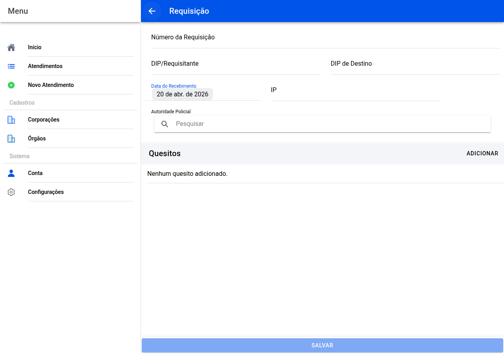

# Requisição

## Captura do ecrã

Documento que **mandou** o trabalho pericial.

## Campos habituais

- **Número da requisição**
- **DIP de origem** e **DIP de destino** (se for diferente)
- **Data em que recebeu** a requisição
- **IP** (inquérito ou registo que acompanha)
- **Autoridade policial** — escreva na caixa de pesquisa e escolha nas sugestões quando aparecerem

## Quesitos

Os **quesitos** são perguntas oficiais do mandado. Use **Adicionar** para cada um: escreva a **pergunta** e o que vai à resposta (**R:**). Toque numa linha para **alterar**; use o ícone do **caixote** para **apagar** uma entrada.

Termine com **Salvar**.

← [Dados básicos](09-identificacao.md) · [Índice](README.md) · [Local do fato →](11-local.md)
