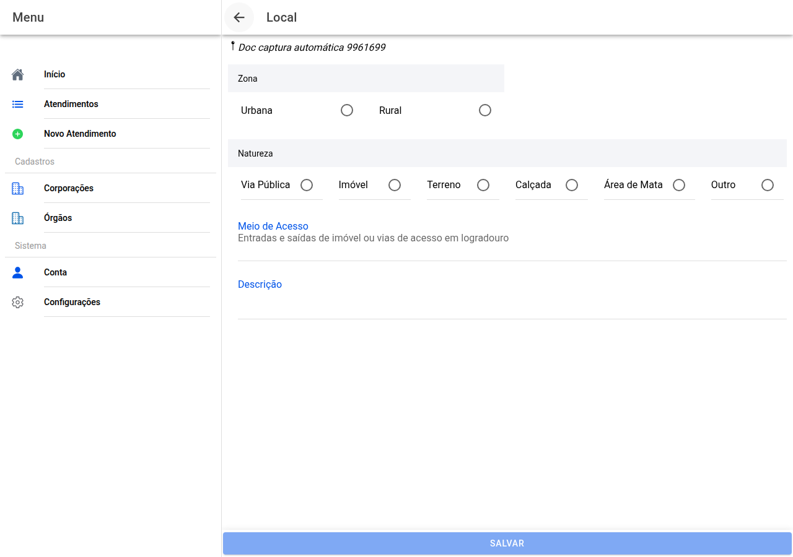

# Local do fato

## Captura da tela

Descreve **como é o sítio** onde correu o exame, para além da morada que já pôs nos dados básicos.

## O que escolher

- **Zona** — por exemplo urbana ou rural.
- **Natureza** — via pública, imóvel, terreno, calçada, mata, outro… Consoante o que escolher, aparecem **subopções** (função do imóvel, tipo de comércio, tipo de construção na via, etc.).
- **Meio de acesso** — como se entra ou circula no local (texto).
- **Descrição** — observações livres sobre o espaço.

Use **Salvar** quando terminar.

← [Requisição](10-requisicao.md) · [Índice](README.md) · [Preservação →](12-preservacao.md)
