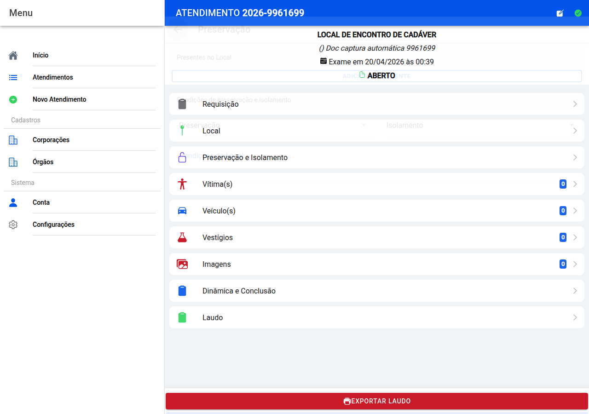

# Preservação e isolamento

## Captura do ecrã

Duas questões principais: **quem estava presente** e **como estava o perímetro**.

## Presentes no local

Para cada pessoa use **Adicionar presente** e indique órgão, nome, cargo, origem e viatura quando fizer sentido. Se o órgão for “outro”, pode especificar.

Pode **remover** uma linha se a tiver registado por engano.

## Condições do local

Escolha como estava a **preservação** e o **isolamento** (listas definidas pela aplicação) e escreva nas **condições do local** o que observou — barreiras, cordões, alterações entre a chegada da polícia e a sua entrada, etc.

**Salvar** no fundo.

← [Local](11-local.md) · [Índice](README.md) · [Vítimas →](13-vitimas.md)
