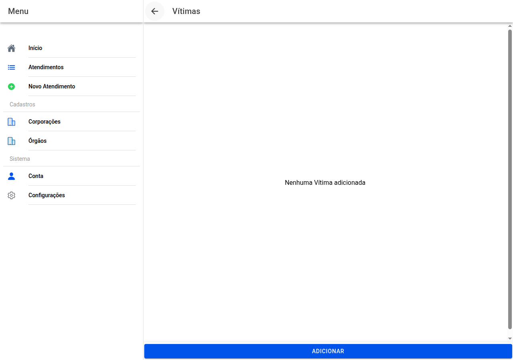

# Lista de vítimas

## Captura do ecrã

Caso o atendimento envolva cadáver ou pessoas a identificar, registe cada **vítima** separadamente.

Use **Adicionar** para criar uma nova ficha. Na lista, **toque** num nome para **abrir o detalhe**. O ícone do **caixote** remove uma vítima *(confirme se lhe perguntar)*.

← [Preservação](12-preservacao.md) · [Índice](README.md) · [Ficha da vítima →](14-vitima.md)
