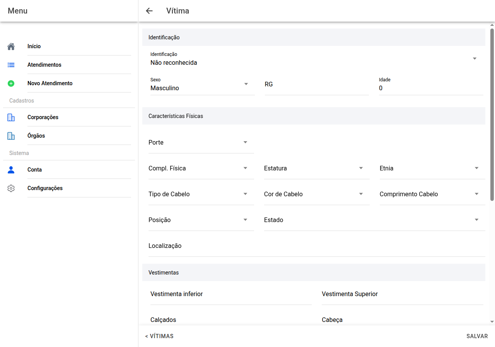

# Ficha da vítima

## Captura do ecrã

Uma entrada completa por pessoa.

## Identificação

Indique se está **identificada**, só **reconhecida**, **não reconhecida**, etc. Quando aplicável preencha **nome**, **sexo**, **RG**, **idade**.

## Aspecto físico

Porte, complexão, estatura, etnia, cabelo (tipo, cor, comprimento), **posição do corpo** no local, **estado** (cadáver, etc.), **onde estava** no terreno.

## Vestimentas

Inferior, superior, calçados, cobertura da cabeça.

## Perinecroscopia e notas

Condições à observação direta, **pertences**, **tatuagens** (onde estão), **observações** gerais.

No fim use **Salvar**. O botão **&lt; Vítimas** no fundo volta à lista.

Os **desenhos do corpo e da cabeça** nesta página abrem o **mapa de ferimentos** — veja o capítulo seguinte.

← [Lista de vítimas](13-vitimas.md) · [Índice](README.md) · [Mapa →](15-mapa-ferimentos.md)
