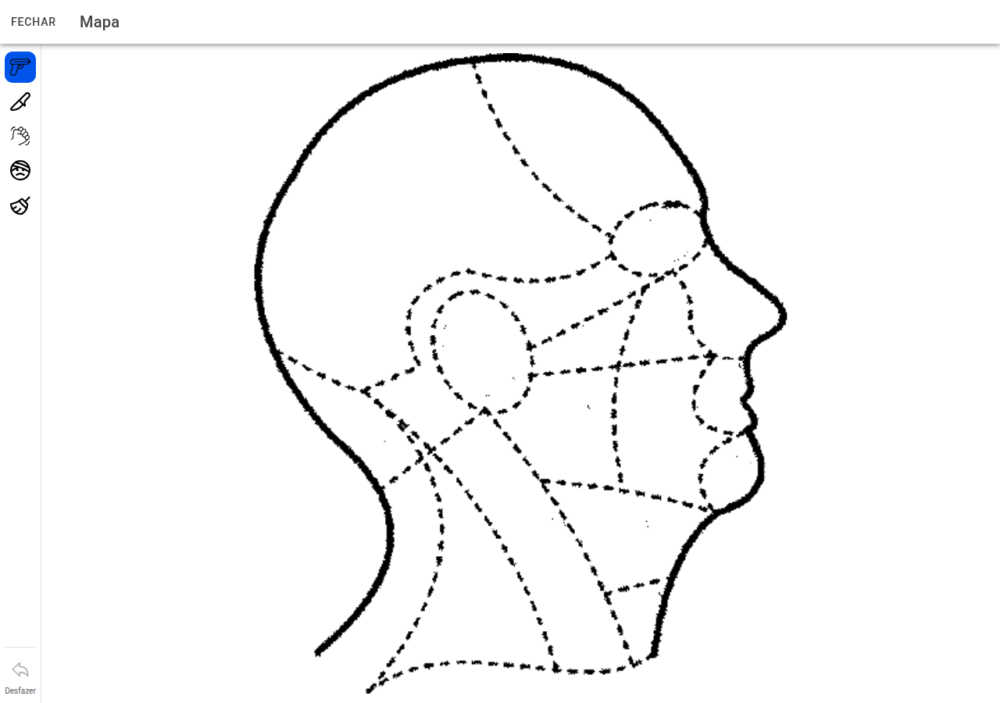

# Mapa de ferimentos

## Captura do ecrã

Ecrã para **marcar no desenho** onde viu cada lesão (corpo inteiro ou vistas da cabeça).

## Ferramentas

À esquerda escolha o tipo de marcação — por exemplo **arma de fogo**, **faca**, **contundente**, **hematoma**. Há também **borracha** para apagar marcações e **desfazer** o último gesto.

Toque no desenho para posicionar. **Fechar** na barra superior regressa à ficha da vítima.

← [Ficha da vítima](14-vitima.md) · [Índice](README.md) · [Veículos →](16-veiculos.md)
