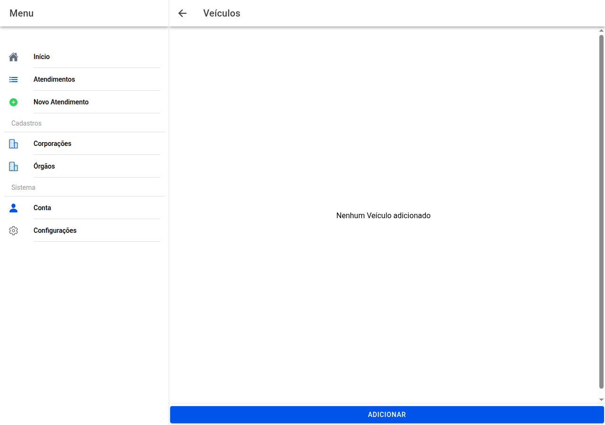

# Lista de veículos

## Captura do ecrã

Todos os **veículos** ligados ao caso aparecem numerados (**Veículo 1**, **Veículo 2**, …).

**Adicionar** no fundo cria nova entrada. **Toque** num veículo para **editar**. Use **Eliminar** dentro da ficha se precisar de retirar um registo.

← [Mapa](15-mapa-ferimentos.md) · [Índice](README.md) · [Ficha do veículo →](17-veiculo.md)
