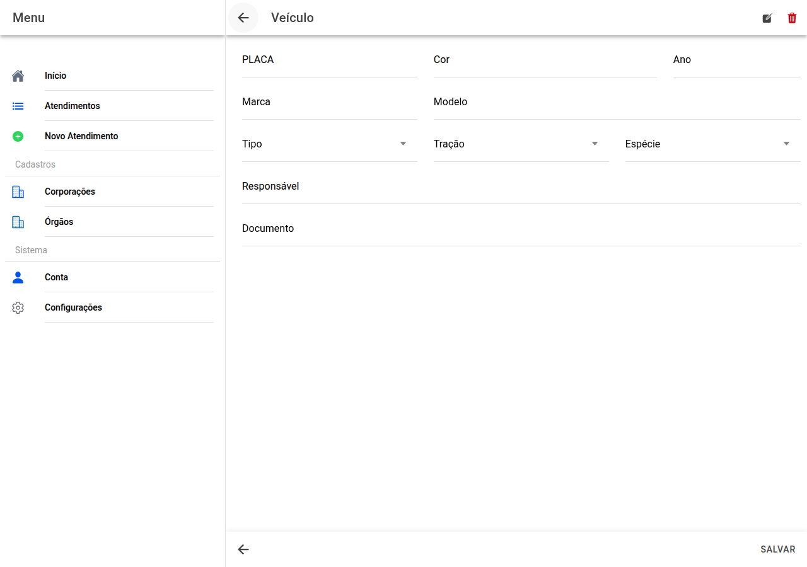

# Ficha do veículo

## Captura da tela

Dados de **identificação** e **consentância**:

- **Placa**, **cor**, **ano**
- **Marca** e **modelo**
- **Tipo**, **tração**, **espécie** (listas)
- **Responsável** por apresentar o veículo e **documento** dessa pessoa

Na barra há **editar** e **eliminar** o registo.

**Salvar** grava; **&lt; Veículos** volta à lista.

← [Lista](16-veiculos.md) · [Índice](README.md) · [Vestígios →](18-vestigios.md)
