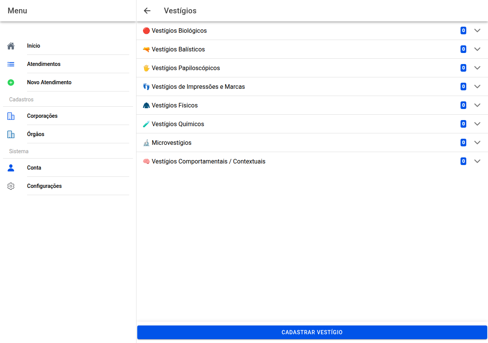

# Vestígios

## Captura da tela

Os vestígios estão agrupados por **categoria** (pode abrir vários grupos ao mesmo tempo).

Em cada linha vê tipo, descrição, quantidade, **onde** foi encontrado e **lacre**, se houver.

**Cadastrar vestígio** no fundo abre o formulário novo. Dentro de cada linha usa **lápis** para **alterar** ou **caixote** para **apagar**.

← [Veículo](17-veiculo.md) · [Índice](README.md) · [Formulário de vestígio →](19-vestigio-formulario.md)
