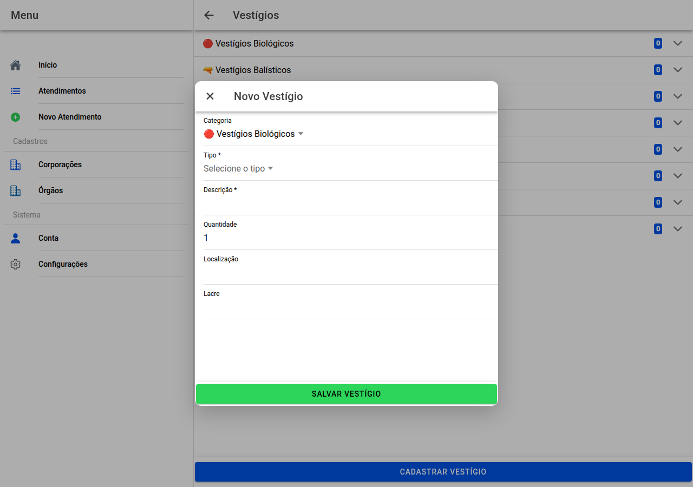

# Cadastro de vestígio

## Captura da tela

Formulário para **novo vestígio** ou **alteração**.

- **Categoria** — escolha primeiro; isso define que tipos aparecem em seguida.
- **Tipo** — lista fixa ou texto livre, conforme a categoria.
- **Descrição** — o que observou ou recolheu.
- **Quantidade**, **localização**, **lacre** — quando fizer sentido.

**Salvar** ou **Salvar alterações** conforme o caso.

← [Vestígios](18-vestigios.md) · [Índice](README.md) · [Imagens →](20-imagens.md)
