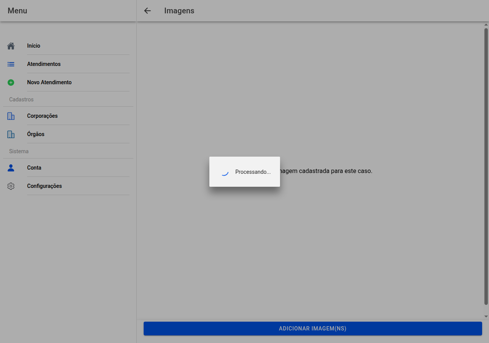

# Fotografias do atendimento

## Captura da tela

*Há ainda a captura `20-imagens-aberta.png` (galeria vazia) no mesmo processo de geração.*

## Adicionar

**Adicionar imagens** abre o seletor de ficheiros (no telefone pode também oferecer **tirar foto**). Pode enviar várias de uma vez; enquanto envia vê o **progresso**.

## Ordenar

**Reordenar** no topo deixa arrastar as fotos na ordem em que quer que saiam no laudo. Quando terminar toque em **Concluir**.

Em modo normal, **toque** numa miniatura para **abrir o editor** (legenda, cortar…).

No fundo pode aparecer indicação do **caminho no Google Drive** quando as fotos ficam lá armazenadas.

← [Formulário vestígio](19-vestigio-formulario.md) · [Índice](README.md) · [Editor →](21-imagem-editor.md)
