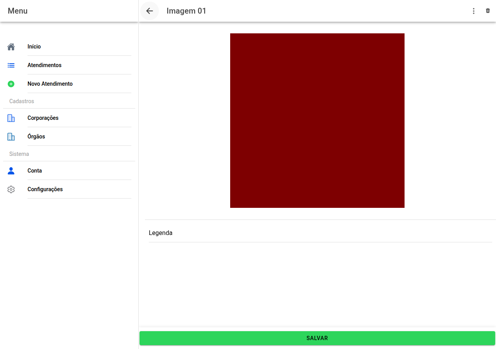

# Editor de uma fotografia

## Captura da tela

Ao abrir uma imagem:

- Escreva a **legenda** que deve aparecer no laudo.
- Use o menu **⋯** para **cortar** ou **rodar**.
- Podem existir opções de **apoio à análise** (realces sugeridos), conforme a sua instituição — são ajudas; a decisão é sempre sua.

**Salvar** confirma alterações; pode também **apagar** a foto se for o caso.

← [Imagens](20-imagens.md) · [Índice](README.md) · [Dinâmica →](22-dinamica-conclusao.md)
