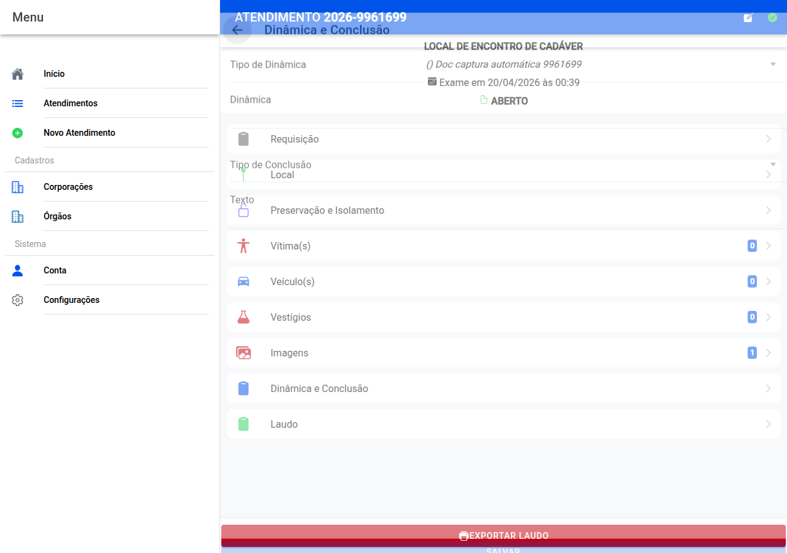

# Dinâmica e conclusão

## Captura do ecrã

## Dinâmica

Escolha um **tipo de dinâmica** na lista — o programa pode **sugerir texto**. Leia sempre e **corrija** no campo grande **Dinâmica** até reflectir o que observou e o que está documentado.

## Conclusão

Escolha o **tipo de conclusão** adequado; outra vez há **texto sugerido** que deve **rever** no campo **Texto**.

Quando estiver conforme o parecer técnico, **Salvar**.

← [Editor](21-imagem-editor.md) · [Índice](README.md) · [Laudo →](23-laudo.md)
