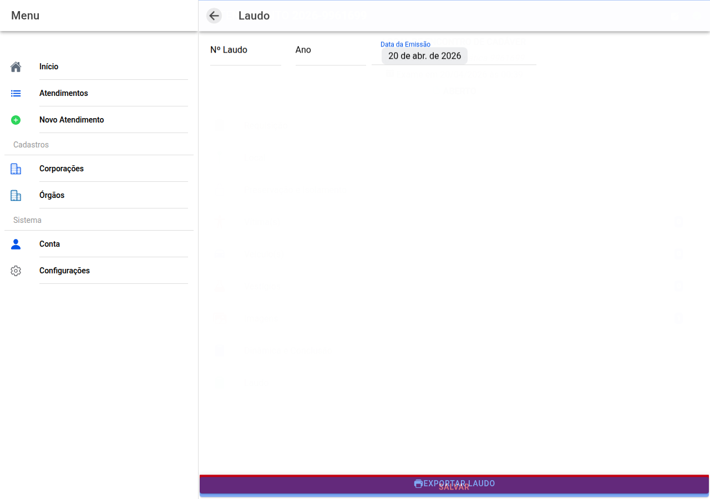

# Dados do laudo no sistema

## Captura do ecrã

Indique como o documento oficial será **numerado** na sua unidade:

- **Número do laudo**
- **Ano**
- **Data de emissão**

**Salvar** para registar.

Estes valores entram na **capa e identificação** do ficheiro Word quando exportar.

← [Dinâmica](22-dinamica-conclusao.md) · [Índice](README.md) · [Guia completo — exportar](../MANUAL_USUARIO.md#19-exportar-o-documento)
